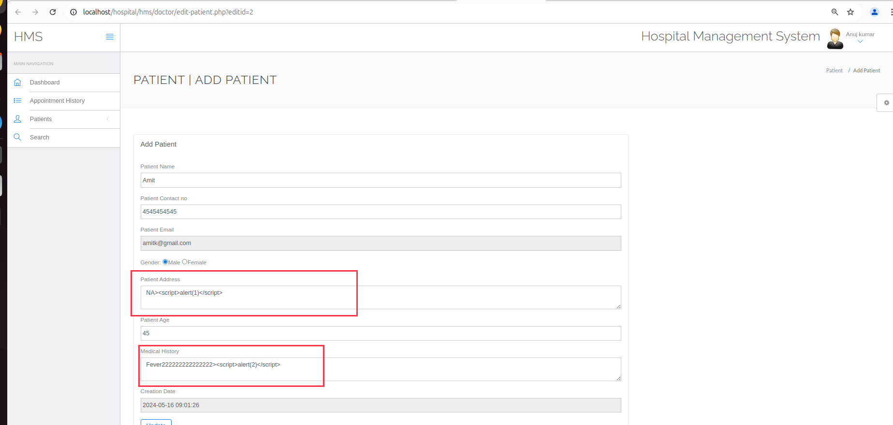
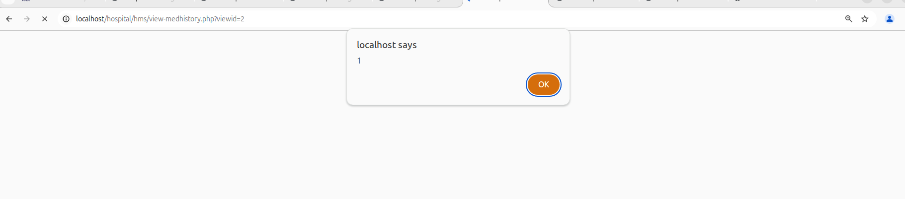
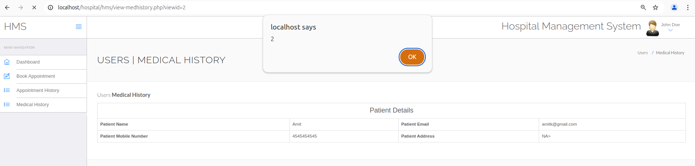
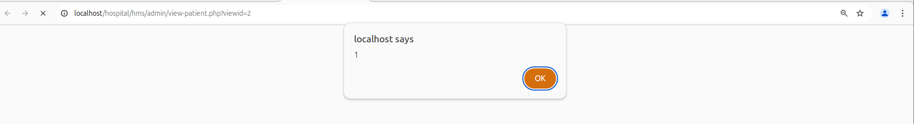
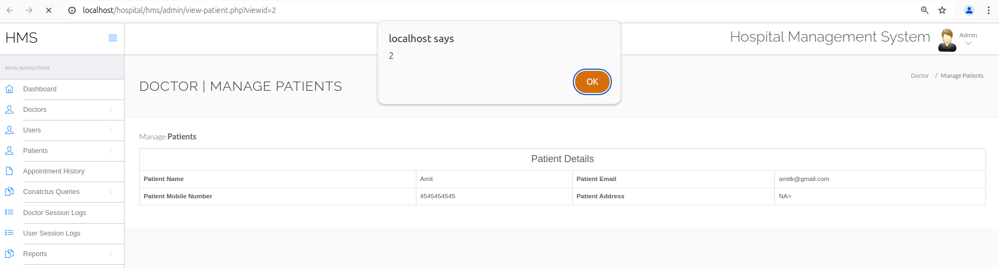

Affected Project: Hospital Management System (HMS)

Platform: Web/Php

Vendor: PHPGurukul

Official Website: (https://phpgurukul.com/hospital-management-system-in-php/)

Version: 4.0

Vulnerable path/file:   
  hms/view-medhistory.php  hms/admin/view-patient.php

#### Vulnerability Description

The parameters $pataddress and $medhis are vulnerable to XSS. And both parameters can write in sql, which cause admin-user execute the script. 

#### Vulnerable code

``` Php
$pataddress=$_POST['pataddress']; # XXS1
$patage=$_POST['patage'];
$medhis=$_POST['medhis']; # XSS2
$sql=mysqli_query($con,"update tblpatient set PatientName='$patname',PatientContno='$patcontact',PatientEmail='$patemail',PatientGender='$gender',PatientAdd='$pataddress',PatientAge='$patage',PatientMedhis='$medhis' where ID='$eid'");
```

#### Demonstration
Spet1. Login Doctor

in http://localhost/hospital/hms/doctor/edit-patient.php?editid=2 with 'Patient Address'(1) and 'Medical History'(2), value include PAYLOAD(>\<script>alert(XSS1)\</script>), and submit request, look likes:



Spet2.1 Login Patient

Go to http://localhost/hospital/hms/view-medhistory.php?viewid=2 can trigger XSS1 and XSS2.





Step2.2 Login Admin

Go to http://localhost/hospital/hms/admin/view-patient.php?viewid=2 can trigger XSS1 and XSS2.






