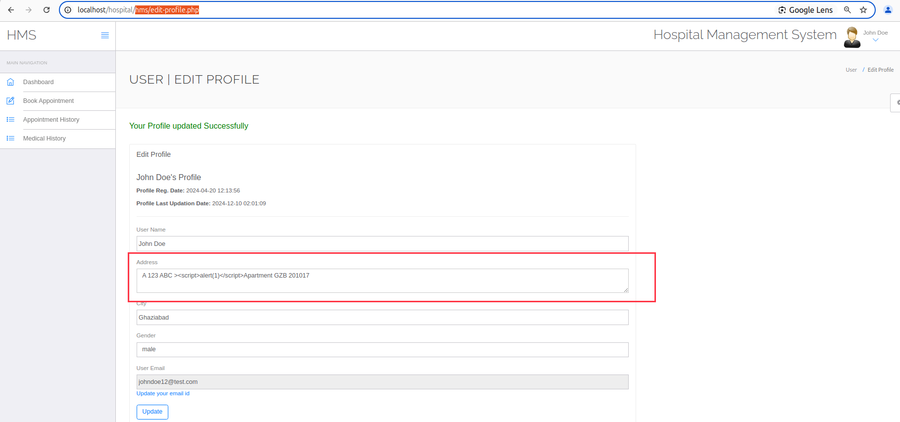
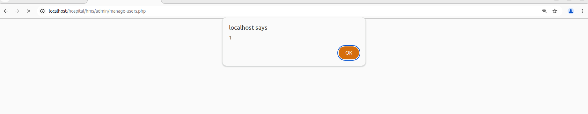

Affected Project: Hospital Management System (HMS)

Platform: Web/Php

Vendor: PHPGurukul

Official Website: (https://phpgurukul.com/hospital-management-system-in-php/)

Version: 4.0

Vulnerable path/file: hms/edit-profile.php

#### Vulnerability Description

The parameter $address is vulnerable to XSS. And the parameter can write in sql, which cause admin-user execute the script. 

#### Vulnerable code

``` Php
if(isset($_POST['submit']))
{
$fname=$_POST['fname'];
$address=$_POST['address'];   # cause XSS
$city=$_POST['city'];
$gender=$_POST['gender'];

# write in sql
$sql=mysqli_query($con,"Update users set fullName='$fname',address='$address',city='$city',gender='$gender' where id='".$_SESSION['id']."'");
```

#### Demonstration
Step1 Login User(Patient)

in http://localhost/hospital/hms/edit-profile.php with 'Address', value include PAYLOAD(>\<script>alert(1)\</script>), and submit request, look likes:



Step2 Login Admin

Go to http://localhost/hospital/hms/admin/manage-users.php can trigger XSS vul.


