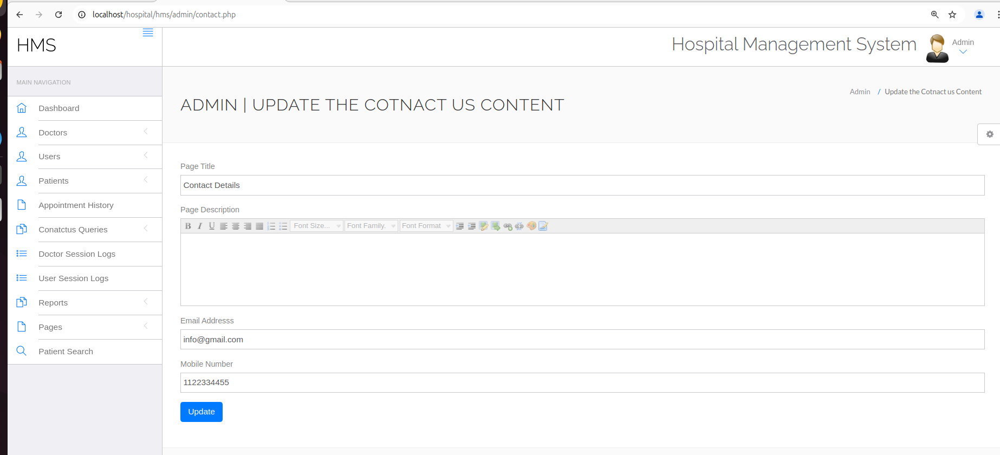
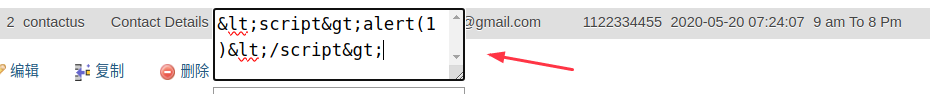
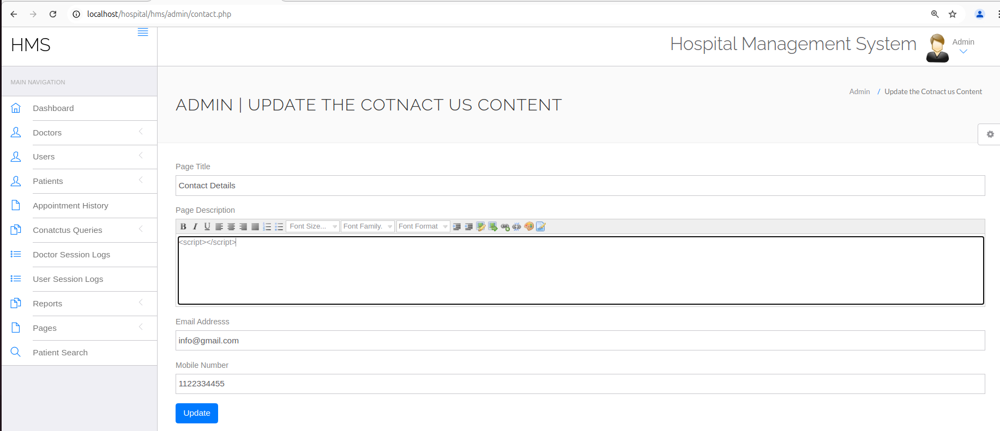
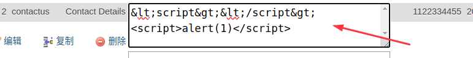
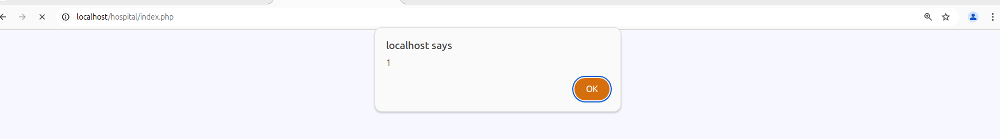

Affected Project: Hospital Management System (HMS)

Platform: Web/Php

Vendor: PHPGurukul

Official Website: (https://phpgurukul.com/hospital-management-system-in-php/)

Version: 4.0

Vulnerable path/file: /hms/admin/contact.php

#### Vulnerability Description

The parameter $pagedes is vulnerable to XSS. And the parameter can write in sql, which cause index.php execute the script. 

#### Vulnerable code

XSS in /hms/admin/contact.php
``` Php
$pagetitle=$_POST['pagetitle'];
$pagedes=$_POST['pagedes'];   # cause XSS
$email=$_POST['email'];
$mobnum=$_POST['mobnum'];

# write in sql, and trigger in index.php
$query=mysqli_query($con,"update tblpage set PageTitle='$pagetitle',PageDescription='$pagedes',Email='$email',MobileNumber='$mobnum' where  PageType='contactus'");
```

trigger in /index.php
``` javascript
<?php
$ret=mysqli_query($con,"select * from tblpage where PageType='contactus' ");
while ($row=mysqli_fetch_array($ret)) {
?>


<?php  echo $row['PageDescription'];?> <br>
```

#### Demonstration
Step1 Inject payload

Login Admin  
in http://localhost/hospital/hms/admin/contact.php with 'Page Description', inject PAYLOAD(\<script>alert(1)\</script>), and submit request, look likes:



If access the website http://localhost/hospital/index.php now, nothing will happen :(  
Because in SQL, the payload encode in HTML, look likes:



Step2 Inject payload Again

in http://localhost/hospital/hms/admin/contact.php with 'Page Description', inject PAYLOAD(\<script>\</script>), and submit request, look likes:



now, we can see that the PAYLOAD in Step1 inject to SQL success :)



Step3 trigger XSS

Go to http://localhost/hospital/index.php , and trigger XSS in Step1.


