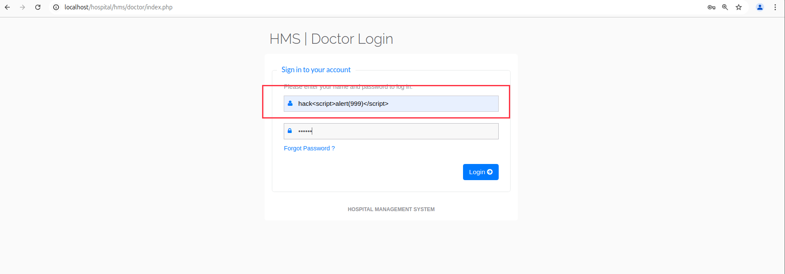
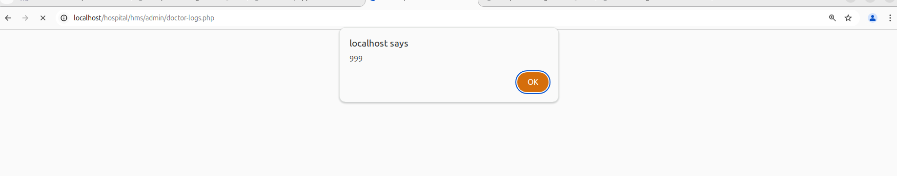
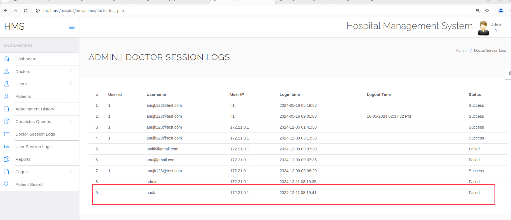

Affected Project: Hospital Management System (HMS)

Platform: Web/Php

Vendor: PHPGurukul

Official Website: (https://phpgurukul.com/hospital-management-system-in-php/)

Version: 4.0

Vulnerable path/file: hms/doctor/index.php

#### Vulnerability Description

Pre-authentication XSS vulnerability in Hospital Management System (HMS) v4.0. When doctor login(hms/doctor/index.php), parameter 'Email' is vulnerable to XSS, even does not require successful login.
And the parameter can write in sql, which cause admin-user execute the script in admin/doctor-logs.php. 

#### Vulnerable code
hms/doctor/index.php
``` Php
if(isset($_POST['submit']))
{
$uname=$_POST['username']; # recv HACK PATLOAD without check
$dpassword=md5($_POST['password']);
$ret=mysqli_query($con,"SELECT * FROM doctors WHERE docEmail='$uname' and password='$dpassword'");
$num=mysqli_fetch_array($ret);
if($num>0)
{
...
}
else
{

$uip=$_SERVER['REMOTE_ADDR'];
$status=0;
mysqli_query($con,"insert into doctorslog(username,userip,status) values('$uname','$uip','$status')"); # write to sql
echo "<script>alert('Invalid username or password');</script>";
echo "<script>window.location.href='index.php'</script>";

}
}
```

trigger XSS in admin/doctor-logs.php
```javascript
while($row=mysqli_fetch_array($sql))
...
<td class="hidden-xs"><?php echo $row['username'];?></td> // XSS vul

```

#### Demonstration
Step1 No authentication required!!

Go to http://localhost/hospital/hms/doctor/index.php , 'Email' include PAYLOAD(>\<script>alert(999)\</script>), 
password can be any strings that meets the requirements and does not require successful login. 
And then click 'Login' to submit request, look likes:



Step2 Login Admin

Go to http://localhost/hospital/hms/admin/doctor-logs.php can trigger XSS vul.




